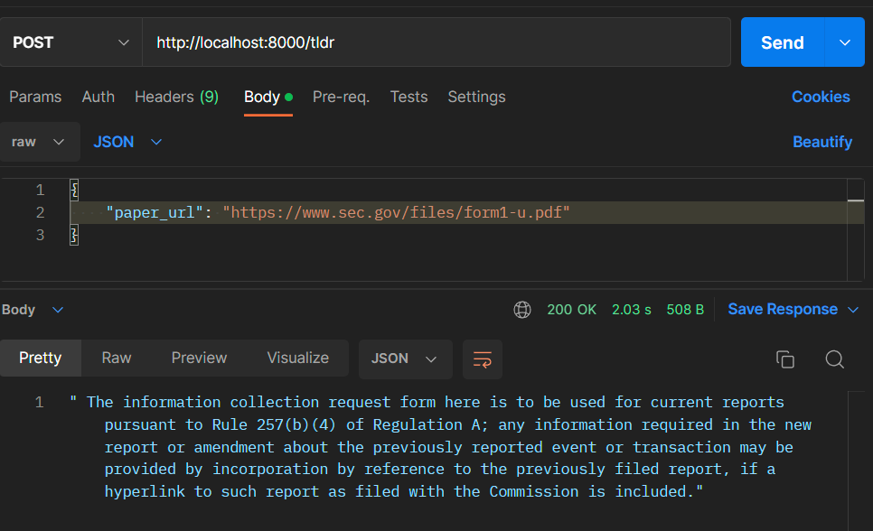

# hotline-bling

A simple showcase of Azure OpenAI's capability to generate a summary of a pdf document.

## Getting Started

To get started, you'll need to have the following installed and provisioned:

- [Python](https://www.python.org/downloads/)
- [Azure CLI](https://docs.microsoft.com/en-us/cli/azure/install-azure-cli)
- [Azure OpenAI](https://azure.microsoft.com/en-us/services/openai/)
- [Docker](https://www.docker.com/)

## Local Setup

To get started, you'll need to create a `.env` file in the root of the project. This file will contain all of the environment variables that are used in the project. You can use the `.env.example` file as a template.

1. Install requirements
```bash
pip install -r requirements.txt
```

2. Set the environment variables from `.env`

3. Run the project locally

```bash
python -m uvicorn main:app --reload
```
4. Run using postman or curl

```bash
curl --location --request POST 'http://localhost:8000/tldr' \
--header 'Content-Type: application/json' \
--data-raw '{
    "paper_url": "https://www.sec.gov/files/form1-u.pdf"
}'
```


### Local Docker run

To run the project locally using docker

```bash
docker-compose up
```
